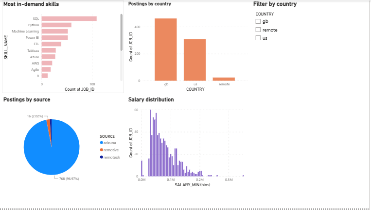

# Job Market Skills Dashboard — Power BI

A Power BI dashboard built on the same job postings data as my [Job Market Dashboard](https://github.com/sheemaloreen/job-market-dashboard) project — I wanted to practice building the same analysis in a different BI tool, since a lot of Data Analyst/BI postings ask for Power BI specifically, not just Tableau or Streamlit.

## What it shows

- **Most In-Demand Skills** — which skills appear most often across postings where a skill was identified
- **Postings by Source** — the split between Adzuna, RemoteOK, and Remotive
- **Postings by Country** — UK, US, and remote postings
- **Salary Distribution** — where salary data was reported
- **Country filter** — a slicer that cross-filters all four charts at once

## A note on the data

This dashboard is built on 792 job postings, but only about 38% of them (303 postings) had at least one skill from my tracked list explicitly identified in the description. That's not a bug — it means most postings don't spell out tool names directly, even when a skill is probably implied (e.g. "strong analytical background" without ever writing "Excel"). So the skills chart reflects explicit mentions only, not the full skill requirements of every posting. I'd rather state that plainly than let the chart imply more certainty than the data actually supports.

## How I built it

The data comes from the same Oracle database as my Job Market Dashboard project — I wrote a small script (`export_for_powerbi.py`) that reads the postings and skills tables and exports them to two CSVs shaped differently for different purposes: one row per posting for source/country/salary analysis, and one row per posting-skill pair for the skills chart. Power BI actually auto-detected the relationship between the two tables on import, which let the country slicer filter both correctly without me manually setting it up.

## Files

- `job_market_dashboard.pbix` — the Power BI file (open in Power BI Desktop)
- `job_postings.csv` / `job_postings_with_skills.csv` — the exported data
- `export_for_powerbi.py` — the script that generated the CSVs from Oracle

## Related project

This is a companion piece to my main [Job Market Dashboard](https://github.com/sheemaloreen/job-market-dashboard), which has the full automated data collection pipeline (Adzuna + RemoteOK + Remotive APIs, GitHub Actions automation) and a live Streamlit version of this same analysis.
